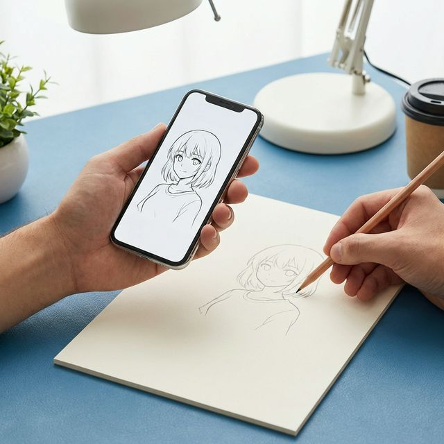
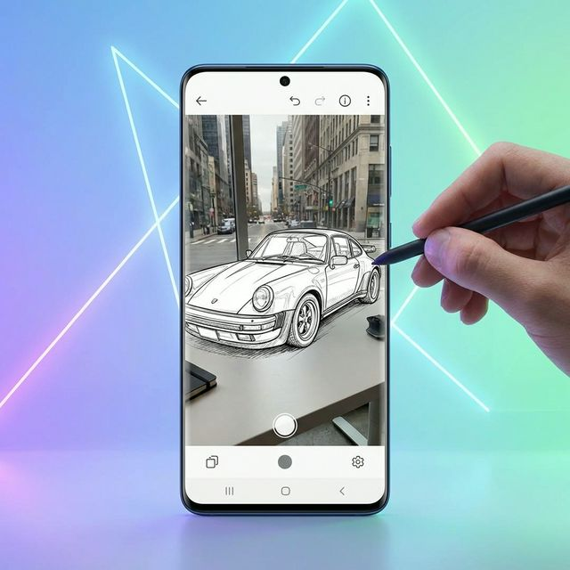
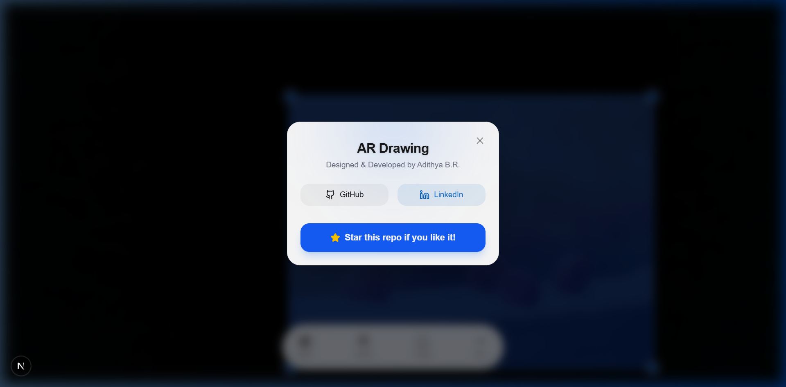

# AR Drawing App 🎨



A sleek, mobile-first web application that overlays your digital sketches onto a live camera feed using Augmented Reality principles. Tracing and practicing your drawing skills has never been easier!



## ✨ Key Features
- **Live AR Tracking**: Stream your device's camera as a real-time underlay.
- **Perspective Distortion (Warp) Setup**: Use a 4-corner perspective warp grid to flawlessly match your sketch's projection to your desk angle.
- **Pinch-to-Zoom & Rotate**: Seamless native touch gestures to quickly scale and position your stencils.
- **Image Cropping Sub-tool**: Intuitively crop uploaded guides right inside the browser before placing them.
- **Individual Controls**: Select an image to independently adjust its scale, rotation, and opacity manually.
- **Grayscale Filter**: Instantly convert noisy colored image backgrounds to B&W for easier tracing.
- **Flashlight & Lens Control**: Easily switch between front and rear cameras, and toggle the device torch (if supported).
- **Auto-Save Workspaces**: Your entire canvas layout and uploaded sketches are saved to `localStorage` so you never lose your progress!
- **Dark/Light Theme**: A gorgeous, glassmorphic UI that responds dynamically to both dark and light modes.
- **Developer About Modal**: An integrated custom modal honoring the repository creator with quick links.

## 🛠️ Tech Stack
Built with modern web technologies for a premium experience:
- **Framework**: Next.js 15 (React 19)
- **Styling**: Tailwind CSS v4
- **Image Manipulation**: `react-image-crop` & `perspective-transform`
- **Gestures**: `@use-gesture/react`
- **Icons**: Lucide React
- **API**: `navigator.mediaDevices` for web camera access

## 🚀 Getting Started

First, clone the repo and install dependencies:
```bash
npm install
```

Then run the development server:
```bash
npm run dev
```

Open [http://localhost:3000](http://localhost:3000) with your browser to launch the AR studio!

<br />

---
<div align="center">
  
  <br/>
  <i>Created by Adithya B.R. - Don't forget to ⭐️ this repo!</i>
</div>
